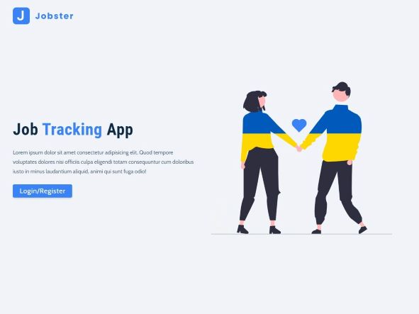

# React - Job Tracker

[This project](https://gurhan-react-job-tracker.netlify.app) is a job application tracker website. The user can signup, login, and start adding the jobs he/she applied for. User can see all the jobs, filter the jobs, search from the jobs and categorize the jobs as pending, declined, interview. This project is built with react and redux.

## Table of contents

- [React - Job Tracker](#react---job-tracker)
  - [Table of contents](#table-of-contents)
  - [Overview](#overview)
    - [The challenge](#the-challenge)
    - [Screenshots](#screenshots)
    - [Links](#links)
  - [My process](#my-process)
    - [Built with](#built-with)

## Overview

### The challenge

Users should be able to:

- Get the list of jobs from API call
- Filter and sort the jobs by using buttons
- Add jobs to jobs list
- See charts of the job applications

### Screenshots

 
 
 
 

### Links

- Solution URL: [Live Website](https://gurhan-react-job-tracker.netlify.app)

## My process

### Built with

- React
- Redux
- Axios
- Functional Components
- CSS
- Styled Components
- React Hooks
- API
